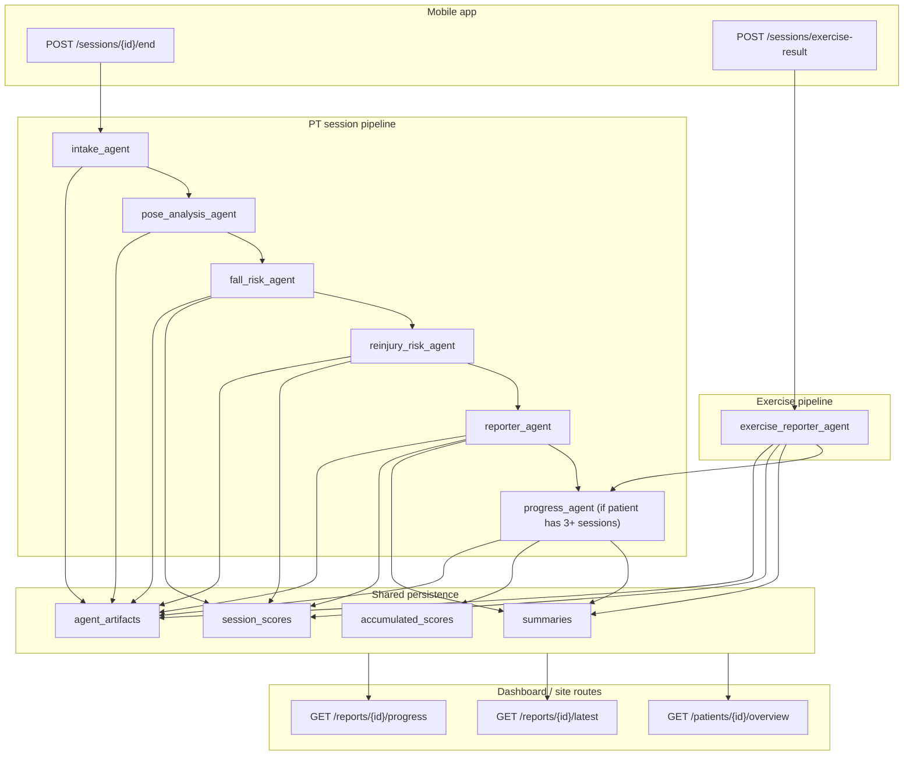

# Agent Architecture

Date: 2026-04-26  
Status: current code path after credibility fixes

## Purpose

This backend has two clinical-output pipelines:

1. PT session pipeline triggered by `POST /sessions/{session_id}/end`
2. Exercise pipeline triggered by `POST /sessions/exercise-result`

Both pipelines feed the same shared storage so the mobile app and the clinician dashboard can render:

- session summaries
- session scores
- structured report artifacts
- longitudinal progress reports

The main dashboard consumer today is `D:\OnTractSite`, which calls only:

- `GET /patients/{patient_id}/overview`
- `GET /reports/{patient_id}/latest`
- `GET /reports/{patient_id}/progress`

If an agent writes useful output that does not reach one of those routes, it is effectively invisible to the site.

## End-To-End Diagram

## Route Contract

### `GET /patients/{patient_id}/overview`

Primary use:

- patient header
- score rings fallback values
- session history list

Current sources:

- `patients`
- `sessions`
- `exercise_sessions`
- `session_scores`
- `summaries`
- `accumulated_scores`

Important note:

- this route already returns grouped exercise visit information through `recent_sessions[].exercises` and `recent_sessions[].num_exercises`
- the current site types are stale and still treat exercise visits like a single `exercise` string

### `GET /reports/{patient_id}/latest`

Primary use:

- latest clinical summary
- session highlights
- recommendations
- evidence map

Current source of truth:

- latest `agent_artifacts` row where `agent_name="reporter_agent"` and `artifact_kind="reporter_output"`

Fallback:

- latest `Summary(agent_name="reporter")`

This matters because the old route returned only the summary text and threw away the structured fields the site is already built to render.

### `GET /reports/{patient_id}/progress`

Primary use:

- overall longitudinal trend
- milestones
- next goals
- longitudinal narrative

Current writes:

- `Summary(agent_name="progress", session_id=None)`
- `AccumulatedScore`
- `AgentArtifact(agent_name="progress_agent", session_id=None)`

The route now commits after `run_progress()` so those writes persist when the endpoint is called directly.

## PT Session Pipeline

### 1. `intake_agent`

File: `backend/agents/intake.py`

Inputs:

- intake payload from the mobile app
- `Patient.metadata_json`

Grounded behavior:

- reads stored clinical metadata deterministically

LLM behavior:

- normalizes pain scores
- extracts target joints
- extracts session goals

Writes:

- `AgentArtifact(agent_name="intake_agent")`

Risk level:

- medium hallucination risk because structured clinical fields are extracted by model output

### 2. `pose_analysis_agent`

File: `backend/agents/pose_analysis.py`

Inputs:

- `PoseFrame` rows for the session

Behavior:

- fully deterministic
- computes per-joint ROM statistics, coverage, and flags

Writes:

- `AgentArtifact(agent_name="pose_analysis_agent")`

Risk level:

- low hallucination risk
- correctness depends on upstream pose capture quality and biomechanical math

### 3. `fall_risk_agent`

File: `backend/agents/fall_risk.py`

Inputs:

- `IntakeOutput`
- `PoseAnalysisOutput`
- optional RAG context

Behavior:

- uses RAG when available
- asks the model for a numeric fall-risk score and rationale

Writes:

- `SessionScore.fall_risk_score`
- `AgentArtifact(agent_name="fall_risk_agent")`

Risk level:

- high hallucination risk because a model assigns a numeric clinical score

### 4. `reinjury_risk_agent`

File: `backend/agents/reinjury_risk.py`

Inputs:

- prior pose artifacts
- recent exercise rep data
- session-score history

Behavior:

- deterministic trend assembly
- model-generated reinjury score and trend explanation

Writes:

- `SessionScore.reinjury_risk_score`
- `AgentArtifact(agent_name="reinjury_risk_agent")`

Risk level:

- high hallucination risk because a model assigns a numeric clinical score

### 5. `reporter_agent`

File: `backend/agents/reporter.py`

Inputs:

- intake output
- pose analysis output
- fall risk output
- reinjury risk output
- last three reporter summaries

Behavior:

- model writes:
  - `summary`
  - `session_highlights`
  - `recommendations`
  - `evidence_map`

Writes:

- `Summary(agent_name="reporter")`
- `SessionScore.pain_score`
- `SessionScore.rom_score`
- `AgentArtifact(agent_name="reporter_agent", artifact_kind="reporter_output")`

Artifact payload now includes:

- summary
- session highlights
- recommendations
- evidence map
- scores
- `reportability="reportable"`

Risk level:

- medium to high hallucination risk in wording
- lower than before for transport, because the structured output now reaches `/reports/latest` intact

### 6. `progress_agent`

Files:

- `backend/agents/progress.py`
- `backend/agents/progress_salience.py`

Behavior:

1. build patient timeline from stored scores, summaries, and artifacts
2. compute salience deterministically
3. send only salient evidence to the model
4. persist longitudinal summary and provenance

Writes:

- `Summary(agent_name="progress", session_id=None)`
- `AccumulatedScore`
- `AgentArtifact(agent_name="progress_agent", session_id=None)`

Risk level:

- medium hallucination risk in narrative language
- salience selection itself is deterministic and grounded

## Exercise Pipeline

### `exercise_reporter_agent`

File: `backend/agents/exercise_reporter.py`

Inputs:

- native exercise payload from the mobile app
- rep features
- rep-level confidence
- rep timing

Behavior:

1. filter reps on quality thresholds
2. compute deterministic session statistics
3. if no reps pass quality:
   - do not call the model
   - write an insufficient-quality summary
   - do not write `SessionScore`
4. if reps pass quality:
   - query RAG
   - ask the model for summary, highlights, recommendations

Writes:

- `Summary(agent_name="reporter")`
- `SessionScore` only when the session is reportable
- `AgentArtifact(agent_name="reporter_agent", artifact_kind="reporter_output")`

Artifact payload includes:

- summary
- session highlights
- recommendations
- evidence map
- good-rep and filtered-rep counts
- scores when reportable
- `reportability`

Why this matters:

- exercise sessions now participate in the same latest-report contract as PT sessions
- dashboards can distinguish grounded reports from insufficient-quality captures

## Shared Persistence Model

### `summaries`

Human-readable narrative output.

Used by:

- session history
- latest summary fallback
- progress context

Weakness:

- text alone does not tell the UI whether a report is grounded, insufficient, or low-confidence

### `session_scores`

Numeric rollup fields:

- `fall_risk_score`
- `reinjury_risk_score`
- `pain_score`
- `rom_score`

Used by:

- score rings
- longitudinal averages
- progress trend calculations

Weakness:

- PT risk scores are still model-generated, not deterministic clinical calculations

### `agent_artifacts`

Structured provenance and agent output.

This is the most important table for trustworthy rendering because it can carry:

- structured report fields
- evidence maps
- data coverage notes
- reportability state
- provenance links

If the UI wants grounded presentation, it should prefer artifact-backed rendering over summary-only rendering.

### `accumulated_scores`

Weighted averages of recent sessions.

Used by:

- overview score rings

Weakness:

- averages can look authoritative even when sourced from model-generated scores or mixed-quality sessions

## What Is Grounded vs Inferred

### Mostly grounded

- raw exercise upload storage
- raw pose frame storage
- pose-analysis statistics
- deterministic exercise rep aggregation
- progress salience selection

### Model-generated or inference-heavy

- intake normalization and goal extraction
- fall-risk numeric score
- reinjury-risk numeric score
- session report prose
- longitudinal progress prose

### Newly added guardrails

- exercise reports skip the model entirely when no reps pass quality
- `/reports/latest` now returns structured artifact output instead of summary text alone
- progress writes are committed from the route path

## Current Truthfulness Gaps

These are still open and materially affect credibility:

1. `src/engine/exercise/frameFeatures.ts` still contains incorrect biomechanics calculations.
   - This contaminates exercise features before any backend agent sees them.

2. PT fall-risk and reinjury-risk scores are still model-generated numbers.
   - The UI should not present them as if they were purely measured quantities.

3. The clinician dashboard still misses valuable structured output.
   - It does not render progress `evidence_citations`.
   - It does not render reportability or data-quality warnings.
   - It does not render multi-exercise visit grouping from `recent_sessions[].exercises`.

4. The dashboard still presents some process visuals as more literal than they are.
   - The PT risk agents are shown like parallel lanes even though the current orchestrator runs them sequentially on one DB session.
   - The pipeline panel is static, not evidence-backed.

## Dashboard Recommendations

If the goal is to look credible rather than merely polished, the site should make these changes next:

1. Render `reportability` and `data_coverage.notes` from `reporter_agent` artifacts.
   - Show `insufficient quality` instead of numeric score cards when applicable.

2. Render `ProgressOutput.evidence_citations`.
   - This is valuable grounded output already produced by the backend.

3. Update the site types to support `recent_sessions[].exercises` and `recent_sessions[].num_exercises`.
   - Multi-exercise visits are currently collapsed into a single label.

4. Replace the static pipeline display with data-backed status.
   - Example: `artifact present`, `insufficient quality`, `not run`.

5. Label score origin.
   - Example: `model-estimated risk`, `deterministic ROM`, `capture quality insufficient`.

## Agent Recommendations

Highest-value backend changes still pending:

1. Fix biomechanics in `src/engine/exercise/frameFeatures.ts`.
2. Add reportability and data-quality fields to overview responses so the site does not have to infer them.
3. Reduce or constrain model-generated PT numeric scoring.
4. Persist a schema version on artifact payloads.
5. Surface low-confidence or insufficient-data states all the way to the UI instead of silently averaging them into score rings.
